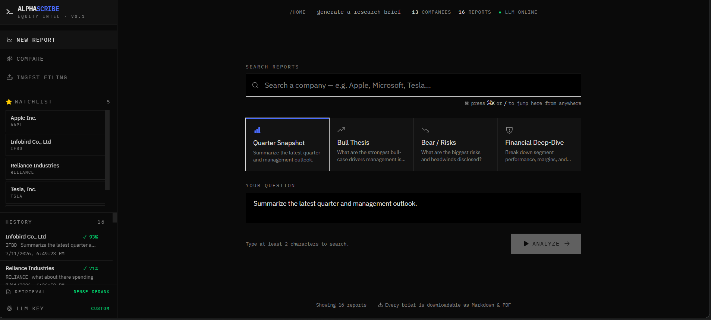
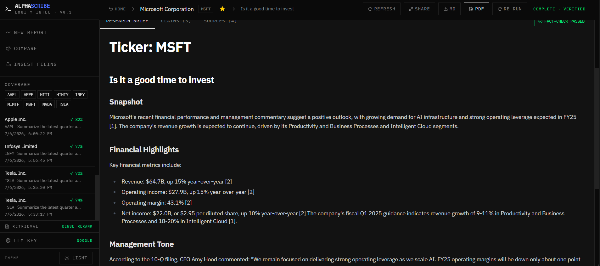

# AlphaScribe — Multi-Agent Equity Research Copilot

AlphaScribe turns raw SEC filings and earnings-call transcripts into concise,
**fact-checked** equity-research briefs. Ask a question about a company, and a
pipeline of specialized AI agents retrieves the relevant filing passages,
extracts the financials, gauges management tone, writes a cited brief, and then
**verifies every numeric claim against the source documents** — retrying the
draft if anything is unsupported.

> Built with a LangGraph agent pipeline, hybrid RAG retrieval (BM25 + dense
> embeddings + cross-encoder re-ranking), and Google Gemini.

---

## ✨ Features

- **Multi-agent pipeline (LangGraph):** retriever → parallel financial-extractor
  + tone/risk analyst → synthesizer → fact-checker, with an automatic
  **retry loop** when claims aren't grounded in the sources.
- **Hybrid retrieval (RAG):** BM25 keyword search fused with dense vector
  embeddings, then re-ranked by a cross-encoder for precision.
- **Grounded, cited briefs:** every brief cites its sources inline as `[1]`,
  `[2]`, … and unsupported numbers are flagged and rewritten.
- **Quality scorecard:** a RAGAS-style scorecard scores each report on
  faithfulness, context precision, and answer relevance.
- **Multiple ingest paths:** paste text, auto-fetch the latest 10-Q/10-K from
  **SEC EDGAR**, load bundled demo filings, or upload an **earnings-call audio**
  file (transcribed with Gemini).
- **Live pipeline streaming:** watch each agent's progress in real time over
  Server-Sent Events.
- **Compare & follow-up:** compare multiple reports side by side and ask
  follow-up questions that build on a prior brief.

---

## 🏗️ Architecture

```
                         ┌──────────────────────────────────────────┐
   React (CRA + shadcn)  │              FastAPI backend             │
   ────────────────────► │                                          │
     REST + SSE          │   LangGraph pipeline                     │
                         │                                          │
                         │     START                                │
                         │       │                                  │
                         │   ┌───▼────────┐   hybrid retrieval      │
                         │   │  retriever │   BM25 + dense + rerank  │
                         │   └───┬────┬───┘                         │
                         │       │    │                             │
                         │  ┌────▼─┐ ┌▼───────┐   (parallel)        │
                         │  │extract│ │  tone  │                    │
                         │  └────┬─┘ └┬───────┘                     │
                         │       └──┬─┘                             │
                         │     ┌────▼──────┐                        │
                         │     │synthesizer│  writes cited brief    │
                         │     └────┬──────┘                        │
                         │     ┌────▼──────┐  verifies numeric      │
                         │     │fact_checker│  claims → retry/accept │
                         │     └────┬──────┘                        │
                         │        END                               │
                         └──────────┬───────────────────────────────┘
                                    │
                 ┌──────────────────┼──────────────────┐
                 ▼                  ▼                  ▼
             MongoDB         Google Gemini        SEC EDGAR
        (filings, chunks,   (extraction, synth,  (filing fetch)
         reports, jobs)      fact-check, audio)
```

**Tech stack**

| Layer | Tech |
|-------|------|
| Frontend | React 19, React Router, shadcn/ui, Tailwind, Recharts, Framer Motion |
| Backend | FastAPI, LangGraph, Pydantic, Motor (async MongoDB) |
| AI / ML | Google Gemini (`gemini-1.5-flash` / `gemini-1.5-pro`), hybrid RAG: `rank-bm25` + `fastembed` dense embeddings + cross-encoder re-ranking |
| Data | MongoDB, SEC EDGAR |

---

## 🚀 Run it locally (one command)

**Prerequisites:** [Python 3.11+](https://www.python.org/downloads/) and
[Node.js 18+](https://nodejs.org/). You do **not** need to install MongoDB —
the launcher downloads a portable copy into the project.

1. **Get a free Gemini API key** at
   [aistudio.google.com/apikey](https://aistudio.google.com/apikey) and paste it
   into `backend/.env`:
   ```
   GEMINI_API_KEY=your_key_here
   ```
2. **Start everything** — double-click **`run.bat`** (Windows) or run:
   ```bash
   python run.py
   ```
   The first run sets up a Python virtualenv, downloads a portable MongoDB, and
   installs frontend dependencies (a few minutes). Later runs start in seconds.
3. Open **http://localhost:3000**.
4. On the **Ingest** page, click **Load samples** (or
   `curl -X POST http://localhost:8001/api/ingest/samples`), then pick a company
   on the Dashboard and generate a report.

See **[README-RUN.md](README-RUN.md)** for detailed setup and troubleshooting.

---

## 📁 Project structure

```
backend/
  server.py              FastAPI app: ingest, report generation, SSE streaming
  agents/
    graph.py             LangGraph pipeline definition
    nodes.py             retriever / extractor / tone / synthesizer / fact-checker
    retrieval.py         hybrid BM25 + dense + cross-encoder retrieval
    llm.py               Google Gemini wrapper (structured + free-form output)
    scoring.py           RAGAS-style quality scorecard
    ingest.py            SEC EDGAR fetch + document chunking
frontend/
  src/pages/             Dashboard, ReportView, Ingest, Compare
  src/components/        Scorecard, FinancialsTable, ToneGauge, PipelineLog, …
run.py / run.bat         one-command local launcher
```

---

## 🔒 Notes

- `backend/.env` holds your API key and is git-ignored — never commit it.
  Use `backend/.env.example` as the template.
- The AI features require a valid `GEMINI_API_KEY`. Google's free tier is
  sufficient for local use and demos.

---

## 📸 Screenshots

<!-- Add screenshots or a short demo GIF here for your portfolio:
     
     
-->

_Add a demo GIF or screenshots here._

---

## License

MIT — free to use and adapt.
